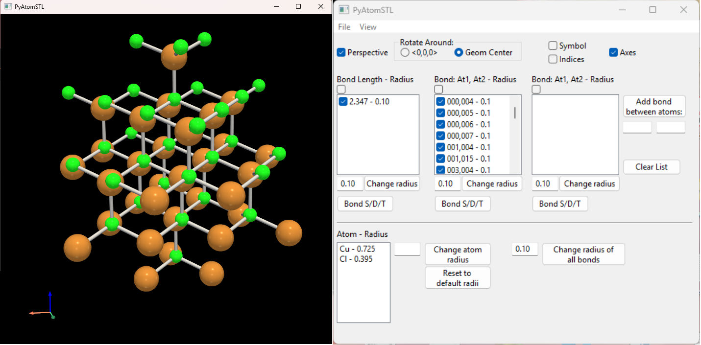
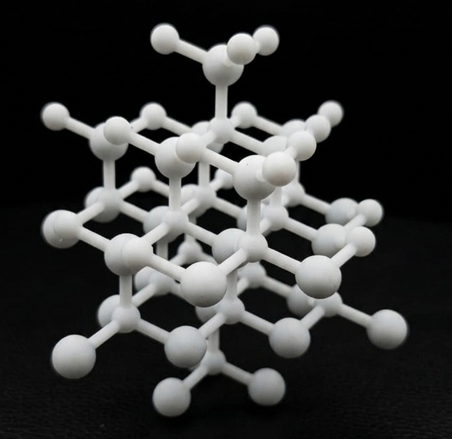

# Summary 
'PyAtomSTL' is an interactive Python application designed to streamline the workflow between computational chemistry data and physical manufacturing. It features a graphical user interface (GUI) built with 'wxPython' and utilizes 'PyVista' as its 3D rendering engine. The software allows users to import standard chemical structure files, such as '.xyz' and '.mol' formats, and dynamically customize the visual representation of atoms and bonds. Crucially, 'PyAtomSTL' compiles these visual representations into a single, unified, and watertight STL mesh optimized specifically for 3D printing and additive manufacturing.

# Statement of Need 
While multiple robust molecular visualization tools exist---such as PyMOL, VMD, and Chimera---they are primarily engineered for digital rendering, analysis, and high-quality image exports. Translating these digital models into physical objects via 3D printing often introduces significant technical bottlenecks. For instance, exporting intersecting spheres (representing atoms) and cylinders (representing bonds) often results in internal overlaps and non-manifold structures that cause slicing software to fail.

'PyAtomSTL' directly bridges this gap by offering an intuitive, lightweight solution targeted at chemical educators, researchers, and hobbyists. By leveraging the geometric Boolean operations and mesh
merging capabilities of 'PyVista' and 'VTK', the software unifies intersecting atomic spheres and bond cylinders into a clean, single-shell surface. This ensures that the generated '.stl' files are completely watertight and ready for direct consumption by commercial 3D printer slicers (such as Cura or PrusaSlicer) without requiring manual repairs in external mesh-editing software like Blender or MeshLab.

# Features and Architecture 
The core application is divided into three interconnected modules:

1. **'ChemFun.py'**: Manages the core chemical informatics lookup tables, storing universal CPK color standards and covalent radii for a wide range of chemical elements. 
2. **'Atom_panel.py'**: Controls the native cross-platform GUI layout via 'wxPython'. It provides sliders and checkboxes for selective rendering, adjusting individual atomic/bond radius scaling metrics, and altering the visual environment (such as toggling perspective views and setting background colors). 
3. **'PyAtomSTL.py'**: Serves as the main orchestrator and rendering pipeline. It handles file parsing, tracks coordinate matrices, generates 3D geometries via 'PyVista', and wraps the secure dialog cleanup blocks
to handle GUI events smoothly.

Furthermore, 'PyAtomSTL' allows users to dynamically filter which specific element groups or individual bonds are included in the final export, making it highly adaptable for creating custom teaching models of complex crystal lattices or macro-molecular fragments.

# State of the field

Generating 3D-printable physical models from molecular and crystalline data typically requires navigating fragmented workflows across multiple software platforms. Currently, researchers and educators rely on three main approaches, each presenting distinct limitations:

1. General-Purpose Molecular Visualizers: Advanced platforms such as PyMOL, VMD (Visual Molecular Dynamics), or UCSF Chimera are excellent for analytical visualization but lack native, robust STL export capabilities. Users typically export structures to intermediate surface formats (e.g., VRML, OBJ, or X3D) and then rely on external mesh-repair software to close non-manifold geometries or correct topological orientation errors before slicing.
2. CAD and 3D Modeling Plugins: Utilizing software like Blender, paired with specialized chemistry add-ons (such as Atomic Blender), allows for high-quality mesh manipulation. However, these tools have a steep learning curve for non-expert users, require manual vertex adjustment, and lack atomic-distance constraint checking, making fast or systematic structural modifications cumbersome.
3. Command-Line Tools and Web Converters: There are script-based converters (e.g., vmd2stl) and lightweight web tools that perform direct file translations. While useful, they operate as black boxes without real-time visual feedback, depriving the user of the ability to interactively preview adjustments to bond multiplicity, custom element colors, or local radii scaling before generating the final mesh.

PyAtomSTL bridges this gap by combining the interactive manipulation of atomic properties found in dedicated visualizers with a direct, hardware-accelerated rendering engine that outputs closed, high-fidelity manifold meshes optimized for additive manufacturing, all within a single desktop application.

# Software design

PyAtomSTL is built following a modular architecture that cleanly separates user interface management, structural geometry calculations, and 3D mesh rendering. This separation of concerns ensures code maintainability and allows for efficient hardware-accelerated updates when the user interacts with molecular models. 

The software architecture is divided into three core components:

1. User Interface (`Atom_panel.py`): Implements a desktop control panel using `wxPython`. This module handles all user interaction windows, menus, event bindings, and inputs (such as adjusting radii values, changing bond multiplicities, or opening file dialogs). It communicates user actions directly to the main application thread.
2. Geometrical and Chemical Logic (`ChemFun.py` and main core): Manages data parsing from chemistry file formats (`.xyz` and `.mol`) using regular expressions. It maintains the mathematical representations of atomic coordinates, computes distances to identify implicit molecular bonds, and tracks user-defined structural modifications (e.g., custom element sizes or double/triple bonds).
3. 3D Viewport Rendering and Mesh Generation (`PyVista`/VTK): Uses the `PyVista` library to interface with the Visualization Toolkit (VTK). It maps abstract molecular data into physical 3D geometries by glyphing high-resolution spheres for atoms and dynamically constructing complex cylinders for multi-layered bonds. Once finalized, the multi-block datasets are merged into a clean, unified outer surface manifold optimized for direct STL export without topology errors.

# Research impact statement
While various molecular visualization tools exist, they often require cumbersome workflows, third-party plugins, or intermediate conversions to generate 3D-printable files. PyAtomSTL bridges this gap by providing an intuitive, interactive environment designed specifically to export molecular and crystalline structures directly into high-quality STL format. By allowing users to dynamically modify bond multiplicities, atomic radii, and custom colors, the software optimizes models for structural stability prior to fabrication.

# AI usage disclosure
Gemini has been used to improve text writing, make systematic changes to the code (translating function names, graphical interface labels, etc.), and search the PyVista documentation.

# Acknowledgements 
We acknowledge the open-source communities behind 'PyVista', 'wxPython', and 'VTK', whose robust libraries made the development of this tool possible.
